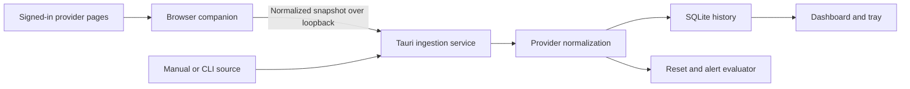

# AI Usage Meter — Milestone 1 Design Specification

**Date:** 2026-09-03  
**Status:** Proposed for implementation  
**Foundation:** `walladanger/ember-studio-foundation`  
**Approved visual target:** `docs/screenshots/ai-usage-meter-dashboard-approved.png`

## 1. Product goal

AI Usage Meter is a local-first Windows 11 utility that answers five questions at a glance:

1. How much personal-plan usage remains for ChatGPT/Codex, Claude/Claude Code, and Gemini?
2. Which provider has the lowest remaining allowance?
3. Which allowance resets next?
4. When will each allowance reset?
5. Is each value current, stale, disconnected, or manually entered?

Milestone 1 focuses on personal subscription allowances. API token usage, API costs, prepaid balances, and organization billing are a separate Milestone 2. The application must never combine those two categories or imply that API usage represents a consumer subscription allowance.

## 2. Repository strategy

AI Usage Meter is a separate repository created from a clean Ember Studio Foundation clone. Ember remains available as a fetch-only `upstream` reference, and its push URL is disabled locally to prevent accidental changes to the foundation.

The application will preserve Ember's existing shell behavior, design tokens, accessibility patterns, window manager, notification infrastructure, settings storage, and external-window support unless a documented AI Usage Meter requirement requires a targeted change.

## 3. Milestone 1 scope

### Included

- Frameless, resizable Tauri Windows application.
- Collapsible left navigation and bottom status bar inherited from Ember.
- Approved Command Center dashboard.
- ChatGPT/Codex, Claude/Claude Code, and Gemini personal-plan sources.
- Chromium browser companion for Chrome, Edge, and Brave.
- Manual allowance and reset-time fallback.
- Optional supported local CLI connector when a provider exposes stable machine-readable status.
- Provider-independent refresh scheduling.
- SQLite history for normalized usage snapshots, reset observations, connection health, and alerts.
- Seven-day combined usage chart with an open-in-new-window control.
- Compact system-tray window and minimize-to-tray behavior.
- Local notifications for user-enabled thresholds and observed resets.
- Source transparency, freshness indicators, and graceful partial failure.
- Local export of usage history.
- Setup flow, Sources, History, Alerts, and Settings screens.

### Deferred to Milestone 2

- OpenAI organization Usage and Costs APIs.
- Anthropic organization usage and cost reporting.
- Gemini API and Google Cloud billing data.
- API keys and organization/project selection.
- API token, request, model, cache, and spend charts.
- Additional providers.

### Explicitly excluded

- Cloud accounts or a hosted backend for AI Usage Meter.
- Telemetry or analytics.
- Password collection or automated login.
- Exporting browser cookies, access tokens, browsing history, or page contents.
- Undocumented remote account APIs.
- Background browser automation.
- Fabricated allowance values, billing values, or reset times.
- Docker, enterprise administration, team billing, or multi-user access.
- Unrelated Ember redesigns or refactors.

## 4. User experience

### 4.1 Command Center

The approved dashboard is the implementation target. It contains:

- The AI Usage Meter title bar and native window controls.
- A collapse glyph at the top of the navigation rail with no button-like container.
- Navigation for Overview, Refresh, Alerts, History, Sources, Settings, and Help.
- A heading, last-refresh time, manual refresh action, and notification control.
- Three equal provider panels with remaining percentage, progress bar, reset countdown, source type, connection state, and last successful refresh.
- One full-width seven-day usage chart beneath the provider panels.
- A chart pop-out action that opens the chart through Ember's external-window system.
- The existing Ember-style bottom status bar.

The visual design is an opaque smoky-black Ember surface with slate borders and restrained blue accents. Provider colors are secondary identifiers only. The interface must not rely on transparency, ornamental animation, or card nesting.

### 4.2 Compact tray view

Closing or minimizing according to the user's preference keeps the application available in the Windows notification area. Clicking the tray icon opens a small utility window showing:

- Each provider's remaining percentage and reset countdown.
- Lowest remaining allowance.
- Next reset.
- Last update and stale/error indication.
- Open dashboard, refresh, settings, and exit actions.

The tray icon may indicate warning/critical state, but it must not encode the only copy of important status information.

### 4.3 Setup flow

The first-run flow contains four saved-as-you-go steps:

1. Choose the first provider.
2. Install and pair the browser companion or choose manual mode.
3. Set refresh and notification defaults.
4. Confirm connection health and open the dashboard.

Additional providers can be added later under Sources. A failed provider setup does not block using the others.

## 5. System architecture



### 5.1 Desktop application

The React UI consumes provider-neutral application services. React components do not parse provider pages, query provider APIs, access secrets, or perform database operations directly.

The Tauri/Rust layer owns:

- Loopback ingestion endpoint lifecycle.
- SQLite access and migrations.
- Pairing-secret storage through the Windows credential store.
- Tray and native-window lifecycle.
- Startup integration.
- Notifications.
- Export and diagnostic-log file operations.

### 5.2 Browser companion

The Manifest V3 extension uses provider-specific content scripts on an allowlist of provider usage/status pages. Each connector extracts only the minimum fields needed for allowance tracking and emits a normalized observation.

The extension must not transmit:

- Cookies or authentication tokens.
- Passwords.
- Conversation contents or prompts.
- General browsing history.
- Unrelated DOM content.

Data is sent only to an application-controlled loopback address after explicit pairing. The desktop listener accepts requests only from loopback, validates the pairing credential, validates the extension origin where the browser exposes it, enforces a small request-size limit, and rejects unknown providers or fields.

DOM selectors and parsers are isolated per provider and versioned. Provider page changes must fail closed as `connector_update_required`; old values may remain visible only when clearly marked stale.

### 5.3 Provider adapter contract

```ts
interface PersonalUsageAdapter {
  readonly providerId: ProviderId;
  readonly sourceType: 'browser_extension' | 'cli' | 'manual';
  validate(raw: unknown): ValidationResult;
  normalize(raw: unknown, observedAt: string): UsageObservation;
  getHealth(): ConnectorHealth;
}

interface UsageObservation {
  providerId: ProviderId;
  accountLabel?: string;
  remainingPercent?: number;
  usedPercent?: number;
  resetAt?: string;
  windowLabel?: string;
  observedAt: string;
  sourceType: SourceType;
  confidence: 'reported' | 'parsed' | 'manual' | 'estimated';
}
```

Unavailable fields stay unavailable. Calculated values must be labeled `estimated` and never presented as provider-reported values.

## 6. Data model

SQLite uses versioned migrations. The minimum entities are:

- `providers`: identity, display name, enabled state, connector type.
- `accounts`: provider association and non-secret account label.
- `allowance_windows`: window identity, reset observation, and source metadata.
- `usage_snapshots`: timestamped normalized percentages and raw unit values when known.
- `connection_events`: success, authentication required, parser failure, timeout, and stale transitions.
- `alerts`: threshold/reset event, severity, delivery state, and cooldown.
- `settings`: refresh cadence, tray behavior, notification preferences, retention, and appearance.

Secrets and pairing credentials must never be stored in SQLite, frontend persistence, logs, or Git.

## 7. Refresh, reset, and stale-data behavior

- Default refresh interval: 5 minutes.
- Available intervals: 1, 5, 10, 15, and 30 minutes, plus manual.
- Providers refresh independently with bounded timeouts and backoff.
- One failure cannot cancel or overwrite successful data from another provider.
- A reset countdown is derived only when a valid `resetAt` is known.
- Crossing the expected reset time does not automatically set usage to 100% remaining. A later observation must confirm the reset.
- The UI retains the last successful value through temporary failure and marks it stale with its age.
- Parser failures preserve diagnostic category and connector version without logging page contents.

## 8. Alerts

Notifications are disabled by default. Users may enable thresholds at 50%, 25%, 10%, 5%, and exhausted, plus confirmed reset notifications. Each allowance window has a cooldown so the same threshold does not repeatedly notify during every refresh.

Dashboard alerts and local activity history work even when Windows notifications are disabled.

## 9. Security and privacy

- Bind the ingestion service to `127.0.0.1` only, never all network interfaces.
- Generate a high-entropy pairing credential and store it in Windows Credential Manager and extension-local storage.
- Require explicit re-pairing after credential reset.
- Use strict extension host permissions limited to the provider pages required by enabled connectors.
- Validate and size-limit every ingestion payload.
- Keep logs structured and useful without secrets or captured page content.
- Store all history locally and perform no telemetry, analytics, or cloud synchronization.
- Show the source and age of every displayed metric in its detail view.

Before a connector is enabled, its current provider page, permissions, supported fields, and known limitations must be documented in `docs/provider-capability-matrix.md` using current authoritative sources.

## 10. Error states

Every provider supports these states independently:

- Connected.
- Updating.
- Authentication required.
- Usage page not open or unavailable.
- Connector update required.
- Rate limited.
- Timed out.
- Manual data due for refresh.
- Stale data.
- No data yet.

The dashboard must state what happened and provide the smallest useful recovery action, such as opening the provider page, signing in, refreshing, repairing the connector, or entering a value manually.

## 11. Testing and verification

### Automated

- Unit tests for normalization, percentage bounds, reset countdowns, stale thresholds, alert cooldowns, and forecast labeling.
- Fixture-driven connector parser tests with sanitized provider-page fragments.
- Contract tests shared by every adapter.
- SQLite migration and restart-persistence tests.
- React tests for complete, partial, stale, empty, and failed dashboard states.
- Tray-state and external-chart-window service tests.
- Payload validation and rejected-pairing tests.
- Regression tests for preserved Ember navigation, settings, dialogs, notifications, and window behavior.

### Manual Windows verification

- Install and launch on Windows 11.
- Pair the browser extension in Chrome and Edge.
- Validate each provider only against an account the user controls.
- Confirm no cookies, tokens, conversations, or unrelated page content appear in payloads or logs.
- Minimize to tray, restore, refresh, and exit.
- Open and close the chart pop-out window.
- Restart the application and confirm history/settings persistence.
- Verify Windows notifications, startup behavior, bad-auth behavior, parser failure, and independent provider failure.

No connector will be described as working until it has passed the applicable automated tests and a real-account Windows validation. Until then it will be labeled implemented but unverified.

## 12. Delivery sequence

1. Rebrand the cloned foundation and preserve upstream isolation.
2. Create the provider capability matrix and sanitized connector fixture policy.
3. Implement the normalized usage domain and persistence layer with tests.
4. Implement the approved dashboard and external chart window with fixture data.
5. Implement tray behavior and the compact tray window.
6. Implement extension pairing and loopback ingestion.
7. Add provider connectors one at a time: ChatGPT/Codex, Claude/Claude Code, then Gemini.
8. Add setup, Sources, History, Alerts, and Settings workflows.
9. Complete automated verification, Windows packaging, and real-account validation checklist.
10. Publish the separate GitHub repository with installation and privacy documentation.

## 13. Acceptance criteria

Milestone 1 is complete when:

- The app installs and runs as a frameless Windows 11 desktop utility.
- The approved dashboard layout is implemented faithfully and remains usable at supported window sizes.
- The tray panel answers the five primary questions without opening the full dashboard.
- Each provider can be configured independently through an extension, supported CLI source, or manual fallback.
- Snapshots persist locally and drive the seven-day chart.
- Reset countdowns, stale states, and alert cooldowns behave correctly.
- One provider's failure does not prevent other providers from updating.
- Secrets are absent from SQLite, frontend persistence, logs, source control, and packaged assets.
- No telemetry or cloud backend exists.
- Automated tests pass, and Windows-only behaviors have an explicit evidence-backed validation result.

